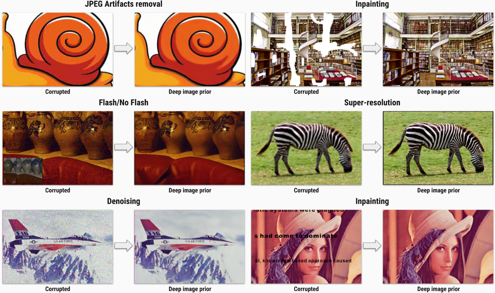

# Deep image prior

In this repository we provide *Jupyter Notebooks* to reproduce each figure from the paper:

> **Deep Image Prior**

>Dmitry Ulyanov, Andrea Vedaldi, Victor Lempitsky


[[paper]](https://sites.skoltech.ru/app/data/uploads/sites/25/2017/12/deep_image_prior.pdf) [[supmat]](https://box.skoltech.ru/index.php/s/ib52BOoV58ztuPM) [[project page]](https://dmitryulyanov.github.io/deep_image_prior)



Here we provide hyperparameters and architectures, that were used to generate the figures. Most of them are far from optimal. Do not hesitate to change them and see the effect.

We will expand this README with a list of hyperparameters and options shortly.

# Install

Here is the list of libraries you need to install to execute the code:
- [pytorch](http://pytorch.org/) > 0.2
- numpy
- scipy
- matplotlib
- scikit-image
- jupyter

All of them can be installed via `conda` (`anaconda`), e.g.
```
conda install jupyter
```

## Docker image

Alternatively, you can use a Docker image that exposes a Jupyter Notebook with all required dependencies. To build this image ensure you have both [docker](https://www.docker.com/) and  [nvidia-docker](https://github.com/NVIDIA/nvidia-docker) installed, then run

```
nvidia-docker build -t deep-image-prior .
```

After the build you can start the container as

```
nvidia-docker run --rm -it --ipc=host -p 8888:8888 deep-image-prior
```

you will be provided an URL through which you can connect to the Jupyter notebook.


# Citation
```
@article{UlyanovVL17,
    author    = {Ulyanov, Dmitry and Vedaldi, Andrea and Lempitsky, Victor},
    title     = {Deep Image Prior},
    journal   = {arXiv:1711.10925},
    year      = {2017}
}
```
